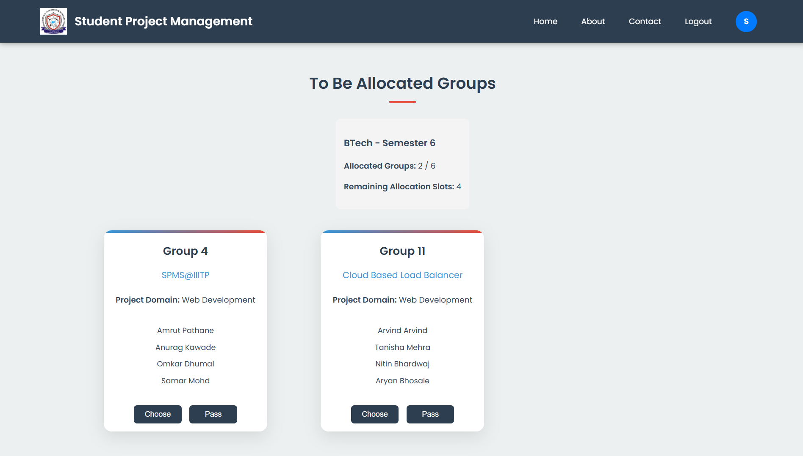

# Student Project Management System @ IIITP

A comprehensive web-based platform developed to manage academic projects across all years and degrees. It supports group creation, faculty preference selection, dynamic faculty allocation, real-time chat, and panel evaluation workflows. This system streamlines communication and improves coordination among students, faculty, staff, and administrators.

---

## 📋 Table of Contents

- [Key Features](#key-features)
- [Tech Stack](#tech-stack)
- [Demo Credentials](#demo-credentials)
- [How to Use the System (Demo Guide)](#how-to-use-the-system-demo-guide)
- [Role-Based Usage](#role-based-usage)
- [System Workflow](#system-workflow)
- [Screenshots](#screenshots)

---

## 🚀 Key Features

- **Student Group Formation** with credentials.
- **Faculty Preference System** with preference order and timestamps.
- **Dynamic Faculty Allocation** based on “Choose” or “Pass”.
- **Live Chat System** using Socket.io between faculty and students.
- **Panel Dashboard** for group evaluation and feedback.
- **Role-Specific Dashboards** for Admin, Faculty, Staff, and Students.
- **Allocation Limit Controls** for faculty based on degree/semester.
- **Admin Controls** to manage users, groups, and reassignment logic.

---

## 🛠️ Tech Stack

- **Frontend**: HTML, CSS, EJS Templates, JavaScript  
- **Backend**: Node.js, Express.js  
- **Database**: MySQL  
- **Real-time**: Socket.io  
- **Authentication**: OTP-based Email & Phone Verification  

---

## 🧪 Demo Credentials

| Role     | Email                           | Password     | Description                               |
|----------|----------------------------------|--------------|-------------------------------------------|
| Student  | `student@example.com`            | `Student@123`| New student, no group yet                 |
| Student  | `112215132@cse.iiitp.ac.in`      | `asasasas`   | Student already in a group                |
| Staff    | `312405001@phd.iiitp.ac.in`      | `asasasas`   | Staff / PhD Scholar login                 |
| Faculty  | `shrikant@iiitp.ac.in`           | `Shrikant@123` | Faculty login                             |
| Admin    | `pathaneamrut@gmail.com`         | `Amrut@123`  | Admin login                               |

---

## 📖 How to Use the System (Demo Guide)

### 🎓 For Students:
1. Login using your credentials.
2. If you're not part of a group, you'll be prompted to **create a group**.
3. Add group members and **select faculty preferences** in order.
4. Track your group's status from the dashboard.
5. Once a group is assigned to a faculty, you can **chat** with them.
6. File upload and sharing is available in chatbox.

### 👨‍🏫 For Faculty:
1. After logging in, access the **"To Be Allocated"** tab to view incoming group requests.
2. Choose to **accept (Choose)** or **forward (Pass)** groups.
3. Accepted groups move to your **"Existing Groups"** tab.
4. Chat with students and monitor their progress.

### 👩‍💼 For Staff:
1. Login to view groups allocated to your corresponding faculty.
2. Assist faculty in managing group information.
3. Chat with students and monitor their progress.

### 🛠️ For Admin:
1. Manage user accounts (students, faculty, staff, other admins).
2. Oversee faculty-group allocations and reassignments.
3. View all groups, users, panels and workflows from the admin dashboard.

---

## 🔄 System Workflow

1. **Students** create groups and submit faculty preferences.
2. Groups appear to faculties **based on preference rank**.
3. Faculty can **accept** or **pass** groups.
4. If all preferences pass, group is **randomly allocated**.
5. Once assigned, students and faculty can **chat** in real-time.
6. **Staff** help faculty to manage groups and track progress.
7. **Panel members** conduct group evaluations.

---

## 🖼️ Screenshots

- Student Dashboard  
  

- Faculty Allocation View  
  

- Group Creation  
  

- Chat System  
  

- Admin Dashboard  
  

- Panel Dashboard  
  

